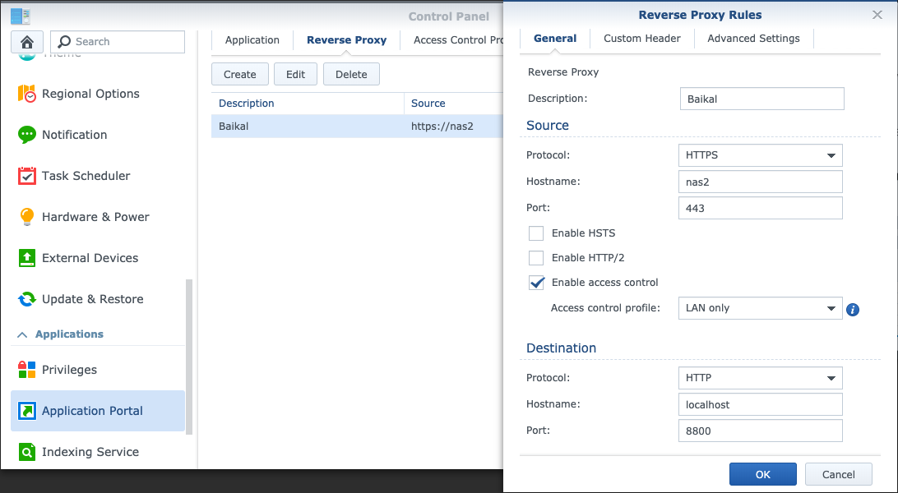

# docker-baikal-infcloud
Dockerized lighttpd + php5 + baikal + sqlite3 + infcloud (e.g. for NAS)

# Install and setup

You need docker, docker-compose installed. The path `./baikal/db` must be writable.

```bash
docker-compose up
```

Visit http://localhost:8800/baikal/html/admin/ to configure baikal.

# Default config

- no mail support
- Cal/CardDAV URL: http://localhost:8800/baikal/html/dav.php/principals/
- Infcloud: http://localhost:8800/infcloud/

# Autodiscovery

You can support easy mail-style (*username@hostname.domain*) setup by with 
configuring service discovery features as described.
[here](http://sabre.io/dav/service-discovery/).

# Example configuration for synology NAS

## Docker setup

## Reverse proxy

Navigate to the *Application Portal* in the *Control Panel* as an *Administrator* in your DSM.
Switch to Tab *Reverse Proxy* and create a new entry as below.



> Note: 
> 
> Hostname and Port contain placeholders and you need to set them with real
> values. The DSM may claim port 80 or 443 as system ports if you enter the
> NAS's hostname without a subdomain. To bypass this check enter a hostname
> like `baikal.nas` as hostname and apply the changes. Afterwards you edit the
> settings again and change the hostname back to `nas`. 
> 
> **Caution: Doing this will remove the default redirection from port 80/443 (http/https)
> to port 5001 (the DSM web interface).**