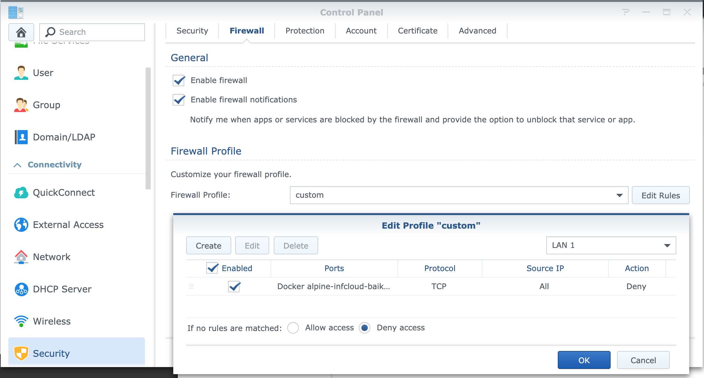

# Example configuration for Synology NAS

## Docker setup

## Firewall

In the *Control Panel* navigate to page *Security* and Tab *Firewall*
Set firewall rule to deny port 8800.

## Reverse proxy

Navigate to the *Application Portal* in the *Control Panel* as an *Administrator* in your DSM.
Switch to Tab *Reverse Proxy* and create a new entry as below.

> Note: 
> 
> Hostname and Port contain placeholders and you need to set them with real
> values. The DSM may claim port 80 or 443 as system ports if you enter the
> NAS's hostname without a subdomain. To bypass this check enter a hostname
> like `baikal.nas` as hostname and apply the changes. Afterwards you edit the
> settings again and change the hostname back to `nas`. 
> 
> **Caution: Doing this will remove the default redirection from port 80/443 (http/https)
> to port 5001 (the DSM web interface).**