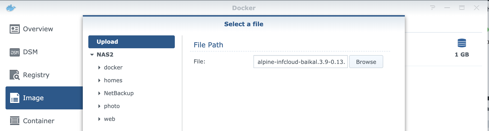
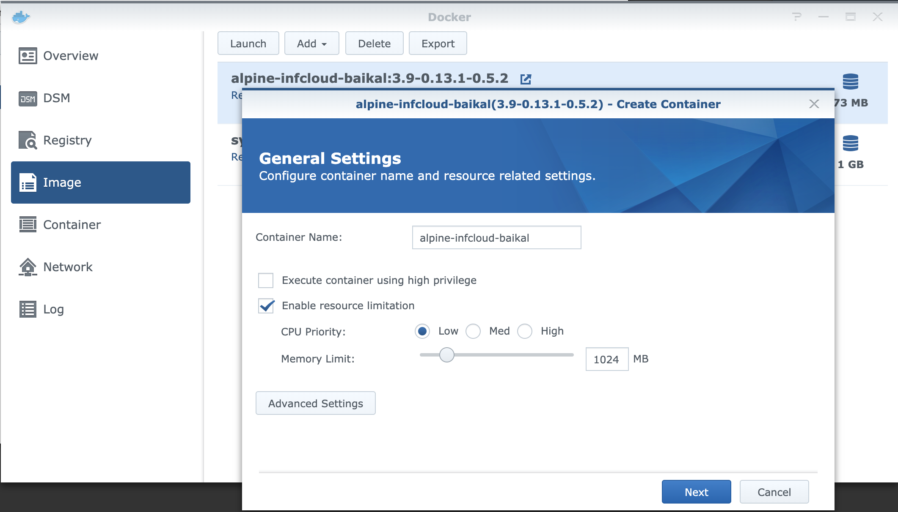
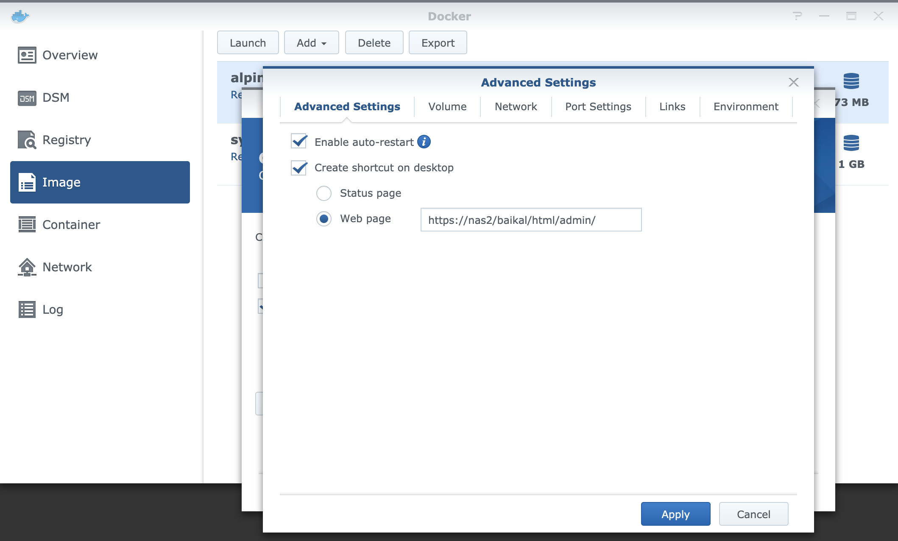
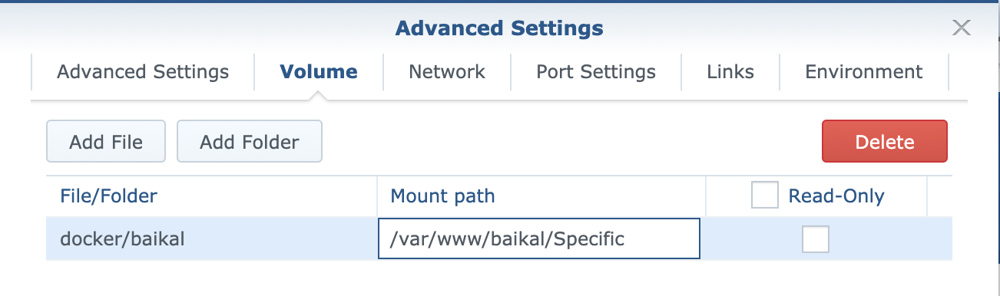
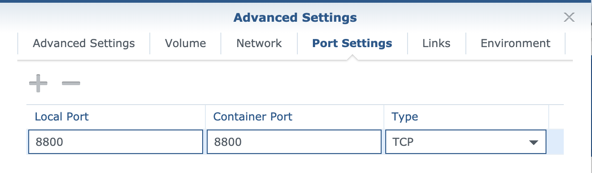

# Example configuration for Synology NAS

## Docker setup

You can build an image yourself with `make export` (see README.md) or download 
from the relase page https://github.com/bjuretko/docker-baikal-infcloud/releases

1. Upload the image 
   

2. Select the image and click on launch. Configure the settings like: 
   

   

   Add folder and map host's path to container path `/var/www/baikal/Specific`

   

   On *Port Settings* set Local Port to `8800` like the container port.

   

### Test 

Go to URL http://nas:8800/baikal/html to configure baikal
check infcloud at http://nas:8800/infcloud
To make use of the .well-known redirects in the container and use 
https setup the reverse proxy.

## Reverse proxy

Navigate to the *Application Portal* in the *Control Panel* as an *Administrator* in your DSM.
Switch to Tab *Reverse Proxy* and create a new entry as below.

> Note: 
> 
> Hostname and Port contain placeholders and you need to set them with real
> values. The DSM may claim port 80 or 443 as system ports if you enter the
> NAS's hostname without a subdomain. To bypass this check enter a hostname
> like `baikal.nas` as hostname and apply the changes. Afterwards you edit the
> settings again and change the hostname back to `nas`. 
> 
> **Caution: Doing this will remove the default redirection from port 80/443 (http/https)
> to port 5001 (the DSM web interface).**

### Test 

Go to URL https://nas/baikal/html to configure baikal
check infcloud at https://nas/infcloud

## Firewall

In the *Control Panel* navigate to page *Security* and Tab *Firewall*
Set firewall rule to deny port 8800.

### Test 

Go to URL http://nas:8800/baikal/htm - you should not be able to

# Synchronize with Android

Install [F-Droid and DAVx5](https://f-droid.org/en/packages/at.bitfire.davdroid/) on your phone.
Setup DAVx5 with username@nas (needs .well-known redirects)
or enter the dav-URL https://nas/baikal/html/dav.php/ directly.

